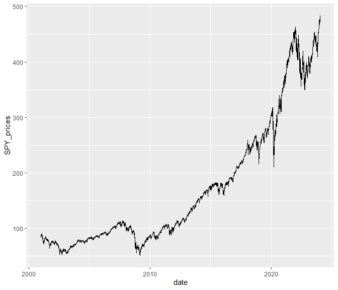

wk2-workshop
================
Tan Kia Hwee. Beatrice
2024-01-24

- [R Markdown](#r-markdown)
- [S&P prices](#sp-prices)
  - [S&P yearly returns](#sp-yearly-returns)

## R Markdown

``` r
stocks_data = readRDS("C:/Users/Beatrice NUS/Y3 Sem 2/DSE3101/Github projects/hello-world/data/wk2_stocks.rds")
#df = readRDS("data/wk2_stocks.rds")

paste("The cumulative returns of the S&P index during this period is", as.character(round(sum(stocks_data$SPY_returns), 2)))
```

    ## [1] "The cumulative returns of the S&P index during this period is 2.18"

``` r
paste("The average daily returns of the S&P index during this period is", as.character(round(mean(stocks_data$SPY_returns), 2)))
```

    ## [1] "The average daily returns of the S&P index during this period is 0"

``` r
paste("The standard deviation of the daily returns of the S&P index during this period is", as.character(round(sd(stocks_data$SPY_returns), 2)))
```

    ## [1] "The standard deviation of the daily returns of the S&P index during this period is 0.01"

# S&P prices

``` r
library(tidyverse)
```

    ## Warning: package 'tidyverse' was built under R version 4.1.3

    ## Warning: package 'tibble' was built under R version 4.1.3

    ## Warning: package 'tidyr' was built under R version 4.1.3

    ## Warning: package 'readr' was built under R version 4.1.3

    ## Warning: package 'purrr' was built under R version 4.1.3

    ## Warning: package 'dplyr' was built under R version 4.1.3

    ## Warning: package 'stringr' was built under R version 4.1.3

    ## Warning: package 'forcats' was built under R version 4.1.3

    ## Warning: package 'lubridate' was built under R version 4.1.3

``` r
ggplot(data = stocks_data, aes(x=date, y=SPY_prices)) +
  geom_line()
```

<!-- -->

## S&P yearly returns

``` r
stocks_data %>%
  mutate(year = year(date)) %>%
  group_by(year) %>%
  summarise(yr_return = sum(SPY_returns*100)) %>%
  ggplot(aes(x=year, y=yr_return)) +
  geom_col()
```

<!-- -->
